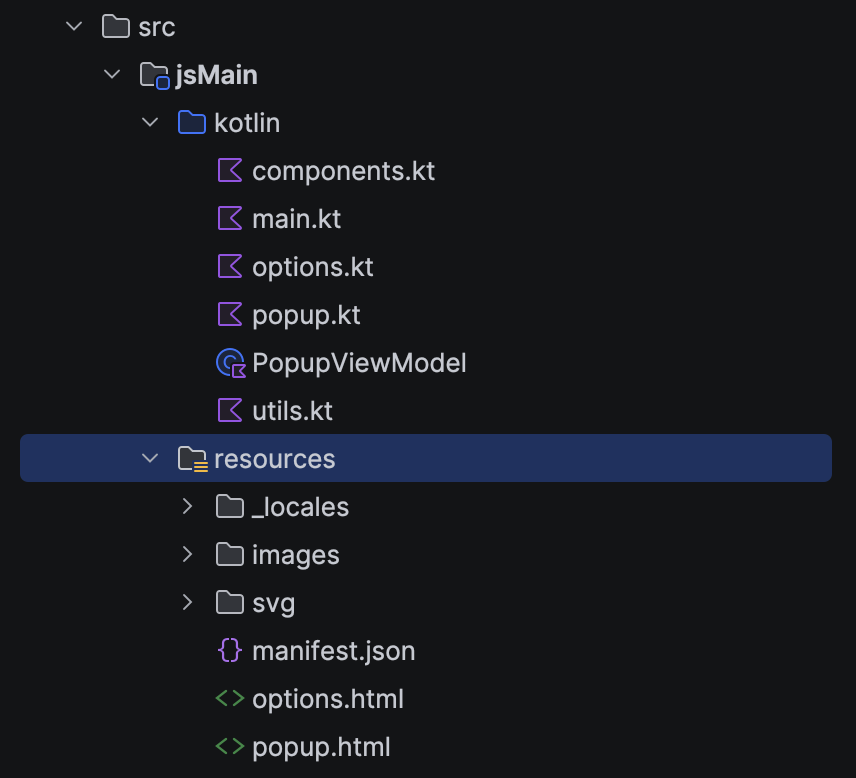
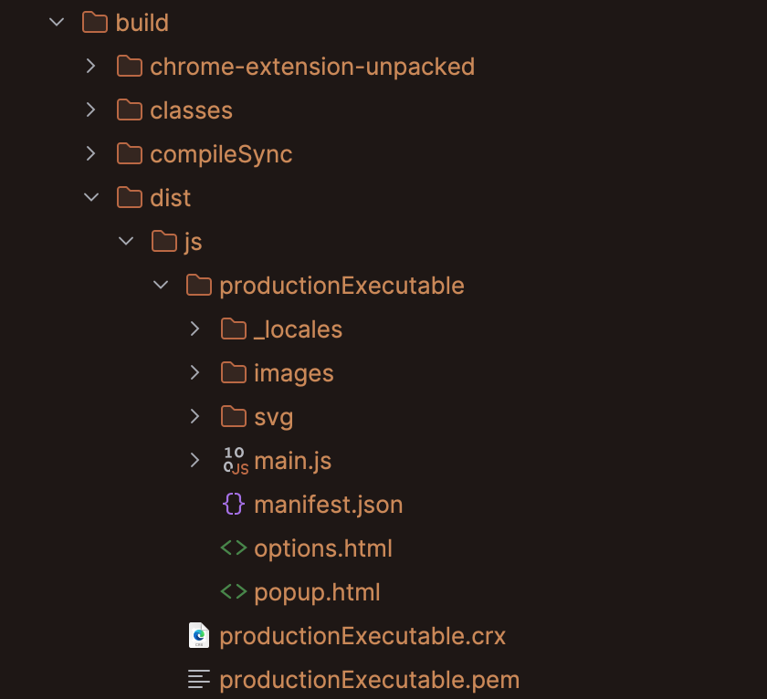

使用 kotlin-js 和 compose-html，开发web应用同样可用

一、配置依赖

libs.versions.toml 配置好版本

```toml
[versions]
kotlin = "2.3.21"
composeMultiplatform = "1.10.3"

[libraries]

[plugins]
kotlinMultiplatform = { id = "org.jetbrains.kotlin.multiplatform", version.ref = "kotlin" }
composeCompiler = { id = "org.jetbrains.kotlin.plugin.compose", version.ref = "kotlin" }
composeMultiplatform = { id = "org.jetbrains.compose", version.ref = "composeMultiplatform" }
```

settings.gradle.kts 配置好仓库

```kotlin
pluginManagement {
    repositories {
        google {
            mavenContent {
                includeGroupAndSubgroups("androidx")
                includeGroupAndSubgroups("com.android")
                includeGroupAndSubgroups("com.google")
            }
        }
        mavenCentral()
        gradlePluginPortal()
    }
}

dependencyResolutionManagement {
    repositories {
        google {
            mavenContent {
                includeGroupAndSubgroups("androidx")
                includeGroupAndSubgroups("com.android")
                includeGroupAndSubgroups("com.google")
            }
        }
        mavenCentral()
    }
}
```

build.gradle.kts 使用 kotlinMultiplatform 和 composeCompiler 插件，然后配置生成 js 目标

```kotlin
plugins {
    alias(libs.plugins.kotlinMultiplatform)
    alias(libs.plugins.composeCompiler)
}

kotlin {
    js {
        browser({
            webpackTask {
                mainOutputFileName = "main.js"
            }
        })
        binaries.executable()
    }

    sourceSets {
        commonMain.dependencies {
        }
        jsMain.dependencies {
            val composeVersion = "1.10.3"
            implementation("org.jetbrains.compose.html:html-core:$composeVersion")
            implementation("org.jetbrains.compose.runtime:runtime:$composeVersion")
            implementation("org.jetbrains.androidx.lifecycle:lifecycle-viewmodel-compose:2.10.0")
        }
    }
}
```

然后 manifest.json、popup.html、options.html、_locales全放 src/jsMain/resources 里就可以了



执行 gradle build 之后，全部东西会生成在build/dist/js/productionExecutable 文件夹下，从chrome扩展管理页面加载这个文件夹就可以了。



打包发布可以直接用chrome打包，也可以写一个gradle task打包成zip。

```kotlin
// 将打包好的代码与静态资源组装
val prepareExtensionDistribution = tasks.register("prepareExtensionDistribution") {
    // 确保在 Webpack 生产环境打包完成后执行
    dependsOn("jsBrowserProductionWebpack")

    val compileDistributionDir = layout.buildDirectory.dir("dist/js/productionExecutable")
    val outputDir = layout.buildDirectory.dir("chrome-extension-unpacked")

    inputs.dir(compileDistributionDir)
    outputs.dir(outputDir)

    doLast {
        copy {
            from(compileDistributionDir)
            into(outputDir)
        }
    }
}

// 将组装好的目录压缩为上传商店所需的 .zip 文件
tasks.register<Zip>("packageExtension") {
    dependsOn(prepareExtensionDistribution)

    from(layout.buildDirectory.dir("chrome-extension-unpacked"))
    // 输出文件名形如：my-extension-v1.0.0.zip
    archiveFileName.set("${project.name}-v${project.version}.zip")
    destinationDirectory.set(layout.buildDirectory.dir("outputs/extension"))

    doLast {
        logger.lifecycle("Extension zipped successfully at: ${destinationDirectory.get().asFile}/${archiveFileName.get()}")
    }
}
```

这里还有个问题，就是gradle 配置里面一个 js {} 只能生成一个js文件，popup.html 和 options.html 要分别引用自己的js怎么办呢？我试过配置多个 js{} 好像也能正常执行，但是AI不建议这样做，说是有潜在冲突的可能，AI更推荐分成不同子模块，每个模块生成一个js文件，但是这样就更复杂了，需要写task把东西放到一起。对于小项目，还有一个办法就是只用一个js，但拆成两个函数，通过判断当前执行的环境执行对应函数。

```kotlin
import kotlinx.browser.window

fun main() {
    when (detectContext()) {
        ExtensionContext.BACKGROUND -> {
        }

        ExtensionContext.CONTENT_SCRIPT -> {
        }

        ExtensionContext.POPUP -> {
            popup()
        }

        ExtensionContext.OPTIONS -> {
            options()
        }

        ExtensionContext.UNKNOWN -> {
        }
    }
}

enum class ExtensionContext {
    BACKGROUND,
    CONTENT_SCRIPT,
    POPUP,
    OPTIONS,
    UNKNOWN
}

fun detectContext(): ExtensionContext {
    val hasWindow = js("typeof window !== 'undefined'") as Boolean
    val hasDocument = js("typeof document !== 'undefined'") as Boolean
    val hasImportScripts = js("typeof importScripts !== 'undefined'") as Boolean

    return when {
        hasImportScripts -> ExtensionContext.BACKGROUND
        hasWindow && hasDocument -> {
            val href = window.location.href
            when {
                href.contains("popup") -> ExtensionContext.POPUP
                href.contains("options") -> ExtensionContext.OPTIONS
                else -> ExtensionContext.CONTENT_SCRIPT
            }
        }
        else -> ExtensionContext.UNKNOWN
    }
}
```

完整代码：

[https://github.com/yqy7/retabs-kotlin](https://github.com/yqy7/retabs-kotlin)

