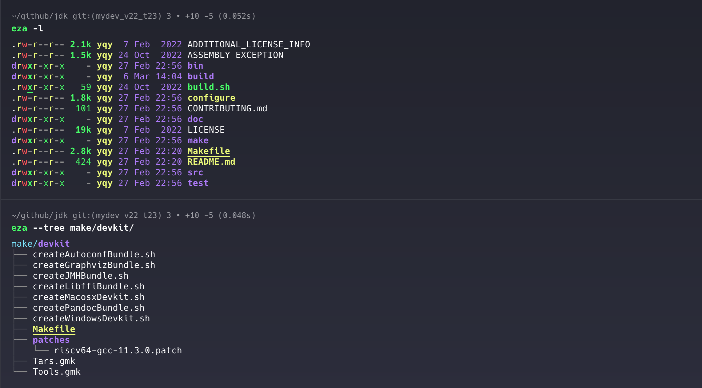
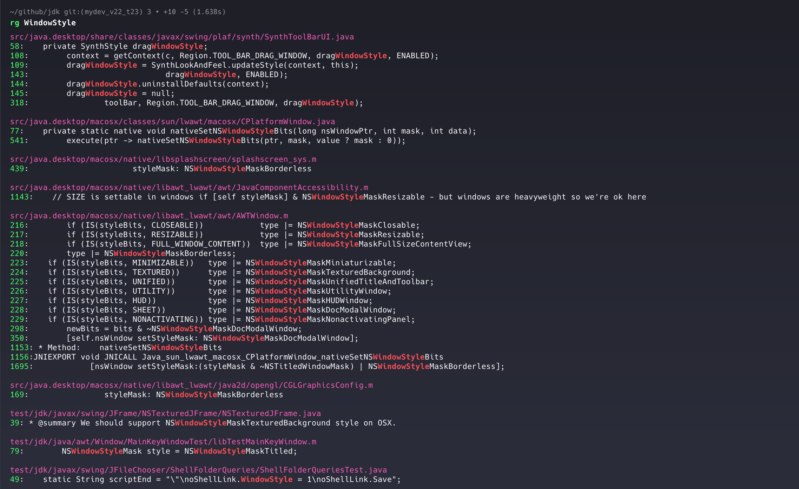
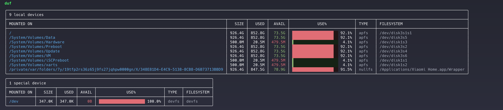
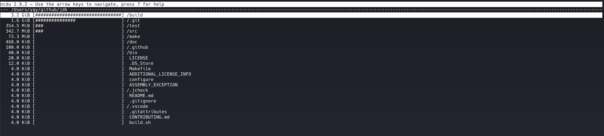
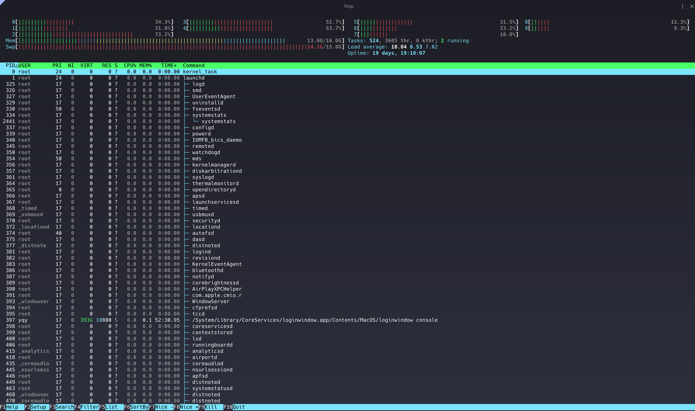
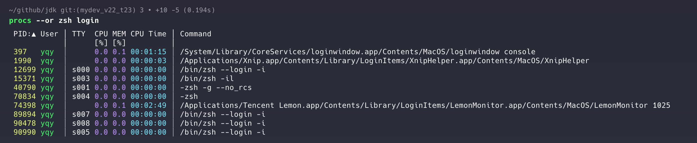
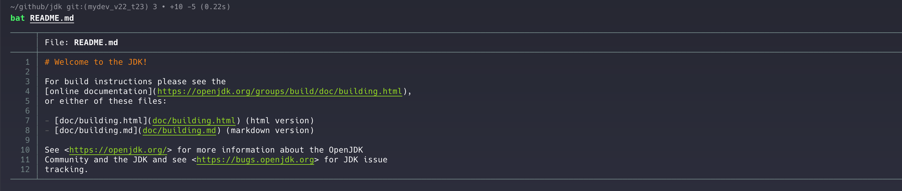

# eza：ls命令的替代品

eza 是 ls 命令的现代版，提供更加美观的界面和更加丰富的功能。使用 rust 实现，性能优秀。

[项目地址](https://github.com/eza-community/eza/tree/main)

# fd：find命令的替代品

fd 是 find 命令的改良版，提供更加简洁直观的语法。使用 rust 实现，性能优秀。

[项目地址](https://github.com/sharkdp/fd)

# ripgrep(rg)：grep命令替代品

ripgrep(rg) 是 grep 命令的替代品，语法简洁，界面美观，性能极佳，用过之后再也忍受不了grep。

[项目地址](https://github.com/burntsushi/ripgrep)

# zoxide：cd命令的智能版

zoxide 是 cd 命令的智能版。zoxide 会记住访问过的目录，可以根据提供的字符串进行匹配，快速跳转到最常访问的目录。通常设置为别名`z`或者`j`

[项目地址](https://github.com/ajeetdsouza/zoxide)

# duf 和 ncdu：df和du命令的替代品

duf 是 df 命令的替代品，显示系统磁盘信息；ncdu 是 du 命令的替代品，显示目录占用的磁盘空间。都提供了更简单的语法和更好看的界面。

[duf项目地址](https://github.com/muesli/duf)

[ncdu项目地址](https://dev.yorhel.nl/ncdu)

# htop：top命令的替代品

htop 是 top 命令的替代品，提供了更简单的用法和更好看的界面。

[项目地址](https://github.com/htop-dev/htop)

# procs：ps命令的替代品

procs 是 ps 命令的替代品，提供更简洁的语法和更友好的界面。

[项目地址](https://github.com/dalance/procs)

# bat：cat命令的替代品

bat 是 cat 命令的替代品，提供更友好的界面。

[项目地址](https://github.com/sharkdp/bat)

# hexyl：hexdump命令的替代品

hexyl 是 hexdump 的替代品，提供更好看的界面。

[项目地址](https://github.com/sharkdp/hexyl)

